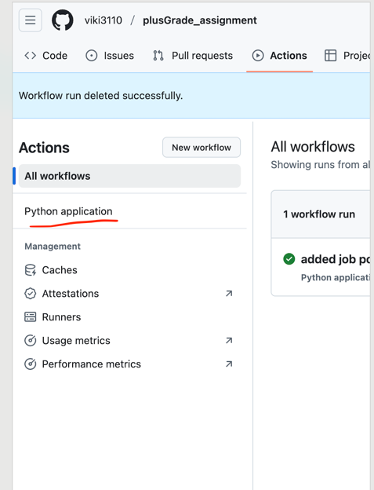
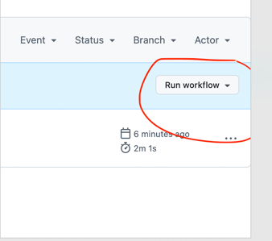
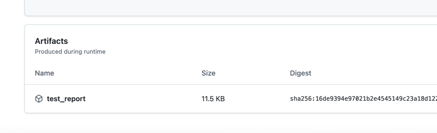
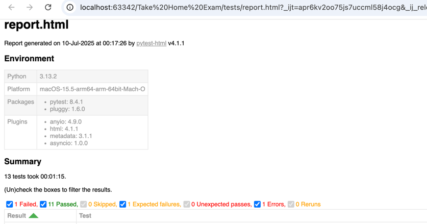

# Ways to Run Test Automation
1. __Locally__
2. __In GIT Workflow__

## <ins>Locally<ins>

[logo]: https://github.com/adam-p/markdown-here/raw/master/src/common/images/icon48.png "Logo Title Text 2"
### Pre-requisite
* Pycharm
* Python

### steps to Run 
   1. Clone or Download the project from Git
   2. Open the project in Pycharm
   3. Setup the interpreter and environment variable.
   4. Open the inbuilt pycharm terminal
   5. Type the command in Terminal -
      *  python -m pytest --html=tests/report.html --self-contained-html tests/test_plusgrade.py
      *  Hit Enter
   6. Wait for Test to finish
   7. click on the Test/report.html
   8. That would bring the report for analysis.

## <ins>Using GIT workflow <ins> 

### Two ways to trigger Test 
    1. Manual trigger
    2. Automated when any new builds deploys

 **Steps to Manual Trigger**

1. login to github and go to project
2. Click on Actions
3. Click on application -

4. click on run workflows
 

5. select branch dropdown and click on run
6. wait for build to be completed
7. After the build completed, click on build
8. Look for 'test_report' and click on it, it would download

9. Unzip the report and open in browser

                  

